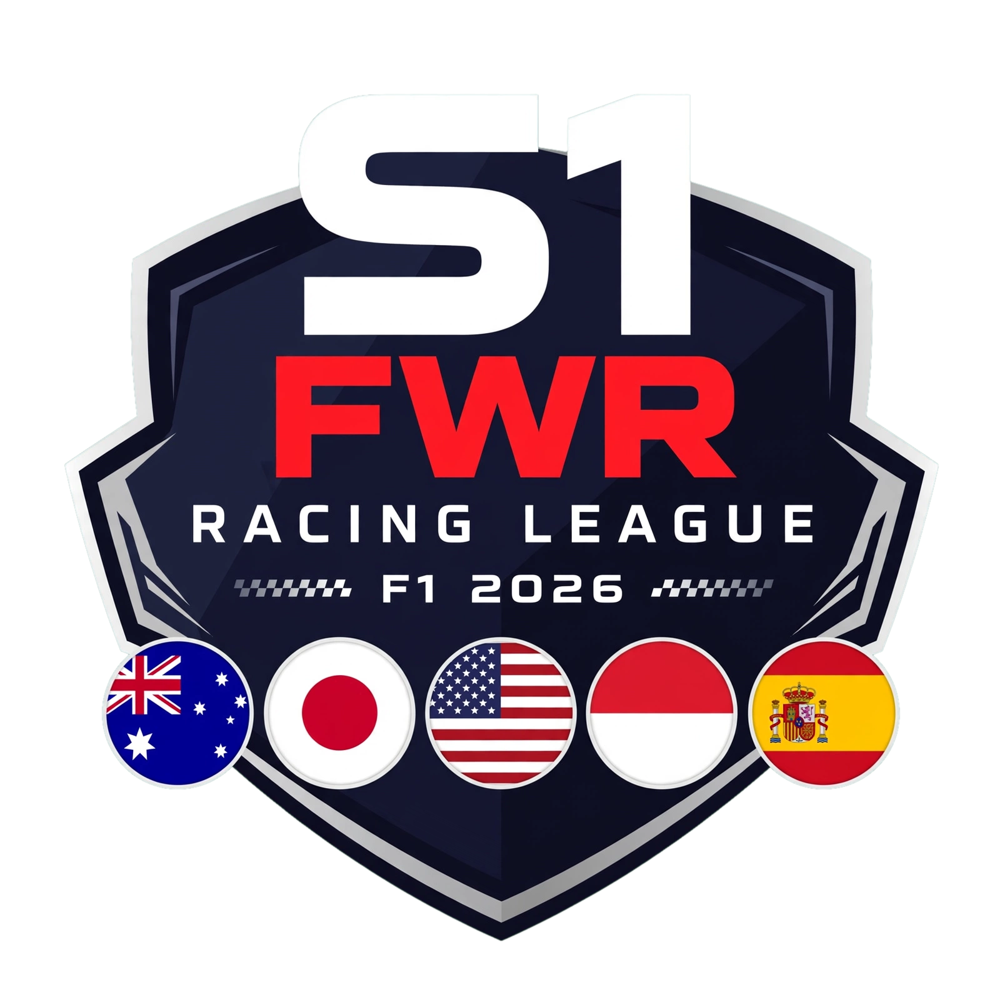

# FWR S1 - V21 ULTIMATE - FR/EN/BE - Gosset_25 Fix - Dynamisme Magnifique



Site officiel ULTIME - SAISON 1 FWR 2026 - V8 ADN Clean Moderne F1
Dernière mise à jour: Barcelone 14 Sept 2026 - V21 ULTIMATE

🔴 LIVE: https://twitch.tv/upsilon7 - Bandeau rouge cliquable

## 🌍 Multi langue FR / EN / BE (Belge)

- FR 🇫🇷: Français - Classement Général, Tableaux GP, Stats & Courbes, Affiches GP
- EN 🇬🇧: English - General Standings, Race Results, Stats & Evolution, GP Posters
- BE 🇧🇪: Belge (fr-BE belgicismes) - Classement Général une fois, septante/octante/nonante, Ça c'est du lourd une fois, Wanze, Kot, Dringuelle, Ça va ou quoi - Oui ils ont leur propre langage!

Sélecteur langue en haut droite header - traduction dynamique complète.

## 🏁 Classement final V21 ULTIMATE

1. Skyyy - Alpine - 125 pts - 5 victoires - RECORD 1:12.865 Monaco + 👑 LEADER animé or
2. Gosset_25 - Red Bull - 118 pts - 1 victoire Bahrain - (ex Goret_25 renommé pour blague)
3. upsilon7 - Ferrari HP - 97 pts - Twitch https://twitch.tv/upsilon7
4. Taatsu7TV - 83 pts
5. Jesui_tou - 68 pts - 2 victoires Melbourne, Suzuka - EN BAISSE
6. cobra_kai_cx - 30 pts
7. JoKeR-_-SkyZo - 25 pts
8. JotagrosFR - 18 pts - Meilleur tour Barcelone 1:15.304
9. mobilou69 - 16 pts
10. sombre7675TTV - 6 pts

## ✨ V21 ULTIMATE - Nouveautés Ultimes

- ✅ Nav unique - seul endroit sur tout le site (pas double haut + après bandeau) - dans header sous logos: Classement | Tableaux GP | Stats & Courbes | Affiches GP
- ✅ Bandeau rouge épais 56px #E10600 sticky top 0 - TOUT CLIQUABLE vers https://twitch.tv/upsilon7 + bouton REGARDER LE LIVE blanc + animation redShift + pulse + shadow
- ✅ Logos apparents: Logo ligue S1 FWR 180px transparent + Logo saison S1 2026 FWR Racing League + glow animé + drop-shadow rouge - tous deux visibles header 140px sticky backdrop-blur
- ✅ Tableaux par Grand Prix: 9 cartes + modal tableau complet Grille Arrêts Meilleur Tour Temps/Ecart PTS chronos 1:21.309 1:37.682 1:33.567 1:33.902 1:30.300 1:19.181 1:12.865 RECORD 1:15.304 MEILLEUR TOUR
- ✅ Stats courbes évolution pilotes: Chart.js X 9 GP Mel Sha Suz Bah Jed Mia Imo Mon Bar Y 0-125 tous pilotes activés par défaut 10 courbes Skyyy #E10600 [0,25,25,25,25,50,75,100,125] Gosset_25 #0600EF [12,30,30,55,55,70,88,106,118] etc pills blancs actifs cotes 1.25/4.0/6.5
- ✅ Classement général en premier: POS 🥇🥈🥉 PTS 24px bold V or FORME ↑↑↑ EN FEU vert → STABLE gris ↓↓ EN BAISSE rouge + badge leader animé or 👑 LEADER pulse + shine
- ✅ Affiches GP: grille 3 colonnes EA F1 25 hover border néon rouge + scale + glow + affiche grand modal + tableau
- ✅ Dynamisme animé magnifique: fond grille carbone animée gridMove, speed-lines rouges qui traversent, particules flottantes float, glow logo, shine badge leader, fadeIn sections, hover translateX + neon, parallax léger, speedMove, animations F1 modernes
- ✅ Multi langue FR/EN/BE: FR/EN/BE avec belgicismes septante/octante/nonante - traduction complète titres tableaux boutons cotes formes
- ✅ Style moderne F1 cohérent: fond #050507 carbone, rouge #E10600, Titillium Web bold, Inter regular, borders #1F1F2A, backdrop-blur, rounded-16px, shadows, moderne 2026 cohérent avec bandeau rouge
- ✅ Clean 100%: plus de badges verts dégueulasses, plus de v13.37, plus de image_d5600e.png, plus de 100% FWR • 0% IA • V13 FINALE
- ✅ Correction Gosset_25: Goret_25 = Gosset_25 renommé pour blague partout

## 📅 Calendrier 9 GP

- 21 Août - Melbourne 19H00 50% - Jesui 25 - 28:14.241 1:21.309
- 22 Août - Shanghai 20H00 50% - Skyyy 25 - 33:58.631 1:37.682
- 24 Août - Suzuka 19H00 50% - Jesui 25 - 30:36.255 1:33.567
- 25 Août - Bahrain 19H00 35% - Gosset_25 25 - 32:15.411 1:33.902 Taatsu
- 01 Sept - Jeddah 19H00 35% - En attente
- 03 Sept - Miami 21H00 35% - Skyyy 25 - 31:36.318 1:30.300
- 06 Sept - Imola 19H00 35% - Skyyy 25 - 1:19.181
- 10 Sept - Monaco 19H00 35% - Skyyy 25 - 34:51.962 1:12.865 RECORD
- 14 Sept - Barcelone 19H00 35% - Skyyy 25 - 30:00.485 1:15.304 Jotagros

## 📂 Arborescence GitHub V21 ULTIMATE

```
fwr-v21-ultimate-github/
├── index.html - SITE V21 ULTIMATE - FR EN BE - Dynamisme - Moderne F1 - Gosset_25 Fix - Nav unique
├── data/
│   ├── standings.json - Classement V21 + Gosset_25 + trends + i18n FR EN BE
│   └── gps.json - Calendrier 9 GP + Twitch + i18n
├── js/
│   └── app.js - V21: nav unique, bandeau rouge cliquable Twitch, logos, badge leader or, tableaux GP, courbes tous pilotes, affiches, modals, dynamisme speed-lines particles, FR EN BE switch
├── css/
│   └── style.css - V21: V8 ADN + bandeau épais cliquable + logo géant glow + badge leader animé + grille carbone animée + speed-lines + particles + nav unique + clean
├── assets/
│   ├── logo/s1-fwr-logo-transparent.png
│   └── posters/ - 9 affiches (à ajouter)
├── vercel.json
└── README.md
```

## 🚀 Update GitHub Vercel

```bash
git add .
git commit -m "V21 ULTIMATE FR EN BE - Gosset_25 Fix - Nav unique - Bandeau rouge cliquable Twitch - Logos ligue+saison - Tableaux GP - Stats courbes - Affiches - Dynamisme magnifique - Style moderne F1"
git push -u origin main --force
```

GitHub Pages: Settings > Pages > Deploy from branch main / root
Vercel: fwr-racing-league - Other - Output ./

Team FWR - Feel the Rush. Win Together. #FWR - V21 ULTIMATE - S1 2026 - FR EN BE - Gosset_25
